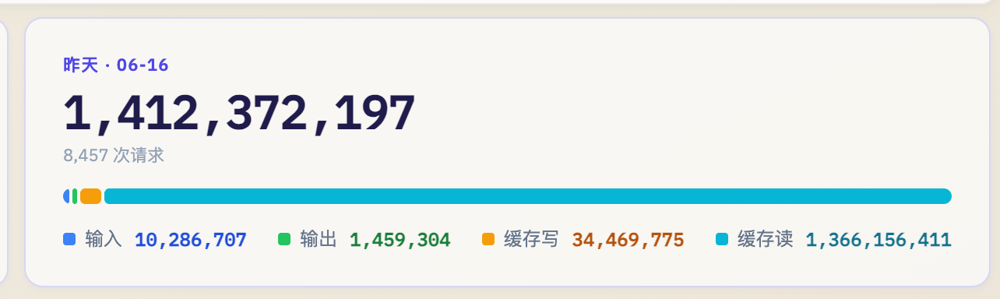

# 模型决定智商，上下文决定工龄

> Memory 让 Agent 记得过去，永续上下文让 Agent 接得上现在。

## 先用 1 分钟了解 Context Window 和 Cache

> 已经了解 Context Window 和 Prompt Cache？可以直接跳到[“什么是永续上下文？”](#什么是永续上下文)。

可以把 Context Window 想成模型的桌面：桌面有固定大小，当前请求里的 System Prompt、工具说明、对话历史和新消息都要摆在上面，模型只能看到桌面里的内容。

例如，一个模型有 1M token 的 Context Window，某次请求可能是：

```text
System Prompt 和工具说明    20K
项目与对话历史             900K
刚收到的新消息               5K
合计                       925K
```

这里的 925K 是当前 Context，1M 是它能容纳的上限。后续消息继续增加，接近上限时就必须压缩或移走一部分内容。

Cache 则是“重复利用上次的阅读结果”：历史前缀没有变化时，服务商直接复用之前的计算，不必每次从头处理。

就像一个团队成员收到新的看板消息时，不需要先把全部项目档案重新读一遍。

假设一个敏捷团队已经积累了 90 万 token 的项目历史：

| 时间 | Agent 收到什么 | 没有 Cache | 使用 Cache |
|---|---|---|---|
| 9:00 | 90 万历史 + “任务 A 卡住了” | 处理全部内容 | 处理全部内容，并建立 Cache |
| 9:05 | 前面的完整历史 + “负责人刚刚回复了” | 再处理一遍全部历史 | 复用旧历史的计算，主要处理新回复 |

第二次请求仍然带着完整历史，所以 Agent 可以直接看到完整工作现场；但相同的旧内容不必再次按完整成本处理。这就是 Cache 对长期 Agent 的意义。

通常，缓存命中的输入会便宜很多。例如 [DeepSeek 当前官方价格](https://api-docs.deepseek.com/zh-cn/quick_start/pricing)中，`deepseek-v4-flash` 每百万 token 的缓存命中价是 ¥0.02，未命中价是 ¥1，相差 50 倍。具体价格可能调整，但“重复历史远低于首次处理成本”已经是常见计费方式。

Cache 不会扩大 Context Window，也不是 Memory。它只减少重复计算，过期后需要重新建立；Memory 才负责长期保存事实和经验。

## 什么是永续上下文？

所谓“永续上下文”，是一段**像生命体一样持续存活的上下文**：它不断吸收新的消息、行动和结果；窗口快满时，通过 compaction 整理记忆、舍弃细节，再带着当前状态和重要经验进入下一阶段。

> 窗口会满，内容会压缩，但这段上下文不会归零，也不会因为会话切换而重新开始。

它不是无限大的 Context Window，而是由三个机制维持的连续生命线：

1. **只追加（append-only）**：新消息和工具结果只加在历史末尾，不反复改写前面的内容；
2. **主动续住 Cache**：Agent 在活跃时以较高 QPS 轮询，在缓存过期前发起下一轮。因为历史前缀保持不变，绝大部分输入都能命中 Cache；
3. **满了再压缩**：接近 Context Window 上限时，把较早的历史压缩成一个新的起点，然后继续追加，而不是清空会话重新开始。

这里的“压缩”也不需要改写旧记录：系统只追加一条压缩结果，让模型从这个新起点继续工作；原始历史仍可保留在账本中。

本文把这种 **append-only 长上下文 + Cache 主动刷新 + 满载压缩** 的运行方式称为“永续上下文”。只要 Agent 继续运行，这条上下文链就能一直延续。它还不是标准的行业术语；类似研究通常使用 persistent memory、perpetual chat 或 unbounded context，例如 [MemGPT](https://research.memgpt.ai/)。

但它有一个明显的问题：**很贵。** 每次轮询都要带上完整历史。假设 Agent 已经积累了 90 万 token 的上下文，一天轮询 1,000 次；如果每次都按普通输入计算，仅旧历史就有 9 亿 token。技术上可以运行，经济上却很难长期铺开。

## 基石：先有便宜的 Cache，才有这种用法

解决办法不是更早丢掉历史，而是让重复读取历史足够便宜。append-only 保持历史前缀稳定，主动刷新让 Cache 不过期；这样即使 Agent 高频轮询，绝大部分输入也在走 Cache，主要成本只剩新增内容和模型输出。

所以因果关系其实是反过来的：**不是先有永续上下文，再想办法省钱；而是先有便宜甚至免费的 Cache，才催生了这种运行方式。** Agent 跑得起，开发者才敢让它长期运行、反复试错，并验证它是否真的会积累经验。

一篇独立文章分析了通过非官方逆向方式使用 Claude 订阅时的额度消耗，结论是：**命中缓存的历史读取不消耗套餐额度。** 这让 Claude Code 长期运行便宜很多。具体过程见 [《Suspiciously precise floats, or, how I got Claude’s real limits》](https://she-llac.com/claude-limits)。这是非官方结论，规则可能调整。

国内也有类似例子：美团的 [LongCat-2.0](https://longcat.chat/platform) 提供 1M 长上下文，Token 资源包命中 Cache 时不消耗包内 Token；但以作者的实际体验，它的模型能力还不足以承担复杂的长期任务，不建议直接用于生产，这里只把它作为免费 Cache 的案例。

### 一张图感受成本差距



这不是压力测试，而是作者使用每月 $200 Claude Code 订阅运行自制常驻 Agent 的普通一天：8,457 次请求，共处理约 **14.12 亿 token**，其中 13.66 亿是 Cache 读取，占总量约 96.7%。

最直观的结论是：**靠一个 $200/月的套餐，14 亿级 token 的普通一天也能应对；如果把同样的用量换成 Claude 官方 API，即使计算 Cache 优惠，一天也会产生数百美元的账单。** 如果没有 Cache，费用还会高得多。具体金额会随模型、缓存策略和官方价格变化，这里只强调量级差距。

> **合规说明：**上述独立文章和截图中的自制 Agent 都涉及非官方的 Claude 订阅逆向接入。Anthropic 的[消费者条款](https://www.anthropic.com/legal/consumer-terms)禁止逆向工程和未经许可的自动化访问，因此这些方法不符合用户协议，本文只引用公开结论，不建议复现。合规实现应使用官方 API，或选择明确允许此类接入的模型与套餐。

## 跑得久以后，Agent 能做什么？

接上 Computer Use 或浏览器操作能力后，Agent 不再只能读写文字。它可以看网页和软件界面、点击、输入、观察结果，再把新的经历留在 Context 和 Memory 中。

长期运行也给了 Agent 一个“学习”的过程。这里不是重新训练模型，而是让它经历真实任务，再把经验带到下一轮。

**compaction（上下文压缩）天然形成了一个记忆沉淀点。** 窗口快满时，Agent 会回顾这一阶段的完整经历，把当前状态、有效方法、失败原因和仍待验证的猜测压缩到下一段 Context。原始过程可以退出工作窗口，但重要经验会继续留下，并被后续结果修正。

```text
行动 → 观察结果 → 窗口快满 → compact 经验 → 下一轮应用和验证
```

例如让 Agent 玩《杀戮尖塔 2》：前几局因为拿牌太多、牌组失控而失败；compaction 时，这段教训会被提炼为“控制牌组规模”，带进下一个窗口。之后它再用新的对局验证卡牌、路线和 Boss 策略，并在下一次 compaction 中更新结论。经过多轮压缩，它留下的不只是胜负记录，而是一套不断被实战修正的策略，因此有机会越玩越好。

这让一些长期、多模态的 Agent 成为可能：

- **管理敏捷团队**：持续读取看板和团队更新，发现卡点，联系干系人并跟进结果；
- **监控与运维**：观察监控面板、告警和日志，结合历史事故判断影响，在授权后执行固定操作或联系值班人员；
- **调查竞品**：定期查看竞品网站、价格、发布记录和产品界面，记录变化并持续更新结论。

## 为什么不自己做一个记忆功能？

当然可以，而且长期 Agent 本来就应该有 Memory。问题不是“要不要记忆”，而是：**为什么任务还没有结束，就要把完整工作现场提前压缩成一个有损版本，再指望搜索把它准确找回来？**

Memory 需要在写入时猜测什么将来重要，摘要会丢掉时间、因果和失败过程，检索也可能漏掉真正相关的信息。如果读取原始历史很贵，这种损失是不得不接受的取舍；cache read 免费后，取舍变了：仍在使用的信息可以低成本留在 Context，变冷或承压后再进入 Memory。

二者不是互斥方案，而是两层记忆：

| 层级 | 作用 | 保存内容 |
|---|---|---|
| Context | 短期工作记忆 | 当前任务的完整现场、工具结果和未完成事项 |
| Memory | 持久化记忆 | 跨任务仍然稳定的事实、经验和技能 |

更合理的循环是：

```text
新消息和行动进入 Context
→ 稳定经验沉淀到持久化 Memory
→ 新任务按需把相关 Memory 带回 Context
→ 新结果继续修正 Memory
```

完整 Context 还是 Memory 系统的对照基线。我们可以比较“保留现场”和“只读记忆”的表现，测出摘要漏了什么、检索是否有效、什么时候压缩最合适。

> Cache 负责便宜，Context 负责连续，Memory 负责积累。

## 一个具体产品：管理敏捷团队的“超级员工”

设想一个从项目第一天就加入敏捷团队的常驻 Agent。它不只回答问题，而是持续参与团队运转：

- 接收看板和团队更新，结合历史承诺、依赖与截止时间发现卡点；
- 在授权范围内联系负责人和干系人，补齐缺失信息；
- 更新看板、风险和下一步行动，并持续跟进到问题关闭。

例如，一张任务卡两天没有进展。普通提醒工具只知道“状态仍是进行中”；常驻 Agent 还知道它依赖谁、团队排除过哪些方案、负责人承诺何时反馈，以及延迟会影响哪个发布目标。它可以联系相关人员，确认新的下一步，把结果写回看板，并继续追踪。

稳定的项目历史持续命中 Cache，Agent 活跃时可以高频跟进，空闲时再等待事件；每一轮主要处理新增信息和必要输出，以较低的边际成本持续协作。当然，新增输入、输出、缓存写入和未命中请求仍有成本。

## 怎么证明它真的有用？

低成本让我们可以做真正的对照实验。使用相同模型、相同团队数据和相同运行时间，对比：

- A 组：短会话 + 持久化 Memory；
- B 组：永续 Context + 持久化 Memory。

然后测量：

- 漏掉多少卡点；
- 重复询问团队多少次；
- 从问题出现到首次跟进需要多久；
- 人工纠正了多少次错误判断；
- 每解决一个卡点的实际模型成本是多少。

这样，“有工龄的 Agent”就不再只是一个故事，而是一个可以观察、比较和复现的产品假设。

## 必须说明的边界

- 大窗口不等于模型能完整理解所有历史，过长 Context 仍需压缩；
- Context 会积累错误和噪声，Memory 也必须允许被后续证据纠正；
- Cache 不是持久存储，失效后只代表需要重新计算；
- 长期保存团队信息需要明确的权限、隔离、审计和删除能力；
- Agent 联系干系人或修改看板必须在授权范围内进行；
- 价格与套餐规则会变化，产品设计不能把临时优惠当作永久承诺。

## 结论

永续上下文不是把所有历史永远塞进 Prompt，也不是用 Context 取代 Memory。它主张一个新的默认顺序：**当前任务的原始现场先保留，稳定经验再持久化，确有压力时才压缩。**

Cache 让这套设计在经济上可行，长期运行产生足够多的样本，样本让我们验证哪些记忆和技能真的有效。模型参数没有变化，但 Agent 因为保留经历、沉淀经验而逐渐变得更有工龄。

> **一个大胆设想：**随着 Prompt Cache 普及并继续降价，永续上下文也许会成为常见架构，甚至被 OpenClaw 这类常驻 Agent 框架采用。框架本身不会让 Token 变便宜，前提仍是模型服务提供足够低价的 Cache；这只是未来设想，不代表 OpenClaw 当前已经这样实现。

> 模型决定智商，上下文决定工龄。

## 参考资料

- [Claude 订阅逆向使用的额度与 Cache 分析](https://she-llac.com/claude-limits)
- [LongCat-2.0：模型、Token 资源包与 API 计费](https://longcat.chat/platform)
- [MemGPT：用分层 Memory 实现扩展上下文](https://research.memgpt.ai/)
- [DeepSeek：模型与缓存命中价格](https://api-docs.deepseek.com/zh-cn/quick_start/pricing)
- [Anthropic Consumer Terms of Service](https://www.anthropic.com/legal/consumer-terms)
- [Anthropic：Prompt Caching](https://docs.anthropic.com/en/docs/build-with-claude/prompt-caching)
- [Google Gemini：Context Caching](https://ai.google.dev/gemini-api/docs/caching)
