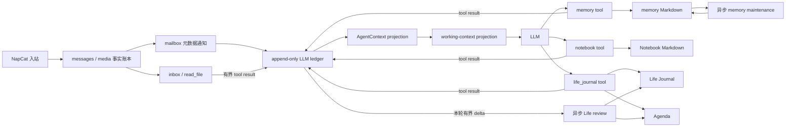

# 记忆架构

本项目的“记忆”不是一个统一数据库，也不等于所有持久化状态。当前目标模型分成三条主线：入站事实账本保存发生过什么，append-only ledger 保存 LLM 已经看到什么，workspace side-data 保存以后可能按需取回什么。`AgentContext` 是 canonical ledger 的当前内存 projection。

**Markdown 是四类长期 side-data 的事实来源。** 当前不引入 SQLite、FTS/BM25 或 embedding/vector index；目录扫描、格式解析和确定性 lexical scoring 直接在 Markdown 上完成。以后即使增加派生索引，它也只能重建、可以丢弃，不能成为写入源或 replay 来源。

普通 `journal` 已退出运行时。长期 side-data 保留四种互补形态：稳定事实用 `memory`，主题演进过程用 Notebook，经历/感受/梦用 Life Journal，当前承诺和下一步用 Agenda。它们不应再次合并成一个万能日志。

## 当前生产契约

- 长期状态只写 Markdown；没有 SQLite、FTS/BM25、embedding、vector database 或隐藏索引文件。
- Memory 召回由主 Agent 显式调用 `memory recall`，runtime 不会在每轮 LLM 请求前偷偷扫描并注入长期记忆。
- Memory、Notebook、Life Journal 和 Agenda 都是按需 side-data；只有受控工具结果进入 `AgentContext` 后，内容才成为可 replay 的 LLM 历史。
- 四类 side-data writer 在单进程内按资源串行，read-modify-write 同时使用 revision/CAS；Markdown 原子替换负责避免半写文件。
- compaction 失败不会截断、覆盖或删除旧 ledger；checkpoint 缺失、过期或损坏时直接从 canonical ledger 重建 projection。
- 辅助 LLM 只接收带 `[UNTRUSTED_DATA]` 边界的历史或 side-data，输出还必须通过 parser/schema 和 store 校验。

## 状态分层

| 层 | 存储 | 是否常驻 LLM | 写入入口 | 读取入口 | replay 角色 |
| --- | --- | --- | --- | --- | --- |
| 入站事实 | Postgres `messages` / `media` | 否 | NapCat ingress | mailbox 通知后用 `inbox` / `read_file` | 只用于 missed-message 披露和按需读取，不重建历史正文 |
| LLM ledger | Postgres `bot_agent_ledger_entries` | 是 | Runtime Host 受控 append / append-only compaction | 每轮自动使用 | 唯一持久 prompt history |
| Working projection | 进程内临时视图 | 是，仅当前请求 | 从 durable ledger 确定性投影 | LLM request | 可重建，不单独持久化 |
| Runtime 控制 | Postgres `bot_agent_runtime_state` | 否 | 与可见 append 同事务更新 | Runtime Host | 不保存或重建 transcript |
| Projection cache | Postgres `bot_agent_checkpoint` | 否 | ledger commit 后 best-effort 刷新 | 启动 loader | 可丢弃、可从 ledger 重建 |
| 长期语义记忆 | `data/agent-workspace/memory/` | 否 | `memory` tool；有界异步 maintenance | `recall/search/list/read` | side-data，不参与 replay |
| 主题过程 | `data/agent-workspace/notebook/` | 否 | `notebook` tool | `list/search/read` | side-data，不参与 replay |
| 主观经历 | `data/agent-workspace/life/journal/` | 否 | `life_journal` tool；异步 round review | `read_recent/read_day/read_entry` | side-data，不参与 replay |
| 当前生活状态 | `data/agent-workspace/life/agenda.md` | 否 | `life_journal write_agenda`；异步 round review | `read_agenda` | side-data，不参与 replay |
| Goal 控制状态 | Postgres `bot_agent_goal` | 否；revision 事件可见 | owner 命令或 `goal` tool | Runtime Host / `goal get` | 不能重建 transcript |
| 运维证据 | `logs/*`、观测表 | 否 | runtime best-effort | 运维命令 | 永远不是 replay 或记忆来源 |

`activeToolCapabilities`、mailbox cursors、continuity、goal revision、last wake 和 ledger head 保存在 runtime singleton，但属于运行控制状态，不属于 LLM 可见记忆。完整不变量见 `docs/AGENT_CONTEXT.md`。

## 总体数据流

关键方向只有两种：外部事实通过受控披露进入 ledger；workspace side-data 只有在工具返回结果时才进入 ledger。异步 reviewer 可以修改自己的 side-data，但不能直接 append 或重建 `AgentContext`。

## 写入路由

| 问题 | 应写位置 | 典型内容 | 不应写什么 |
| --- | --- | --- | --- |
| 这是以后可以直接依赖的稳定事实、偏好、方法或结论吗？ | `memory` | 某人的稳定偏好、反复验证的方法、已确认项目约束 | 当天流水、未验证猜测、长研究过程 |
| 这是围绕一个稳定 topic 演进的过程吗？ | Notebook | 研究证据、阅读进度、市场假设、项目实验和观点变化 | 主观日记、已经稳定的最终事实 |
| 这是值得回看的经历、感受或梦吗？ | Life Journal | `reflection`、`dream` | 研究材料全文、待办清单 |
| 这是当前仍有效的承诺、等待项、未完兴趣或下一步吗？ | Agenda | Active、Waiting、Someday、Done | 历史叙事、永久知识 |
| 这只是刚收到的消息或媒体吗？ | `messages` / `media` | 原始入站事实 | 不因“可能有用”自动复制到四类长期状态 |

同一件事可以发生状态转换，但不要机械复制：研究过程先留在 Notebook；结论稳定后，用自己的话写入 memory；Agenda 只保留指向该 topic 的下一步；Life Journal 最多记录“这件事对我意味着什么”。当前没有自动跨 store promotion，这是一项有意边界。

## 各层存储模型

### Memory

- scope 为 `self|person|group|topic`，路径分别落入 `self/`、`people/`、`groups/`、`topics/`。
- Markdown v1 entry 带稳定 ID、北京时间、`sourceMessageIds` 和 `tier=recent|stable`。
- 普通 write 先生成 recent；完全相同内容在同文件内去重。
- `recall` 扫描 Markdown entry 后做确定性 lexical scoring：精确 ID/alias、短语、分词命中和稳定层级形成可解释分数；`person|group` recall 必须同时提供具体 `id`，只读取 `people/<id>.md` 或 `groups/<id>.md`，目标不存在就返回空。`self|topic` recall 禁止提供 `id`；scope 和 id 都不传时保留跨范围探索，禁止只有 id 而没有 scope。`search` 只做宽泛的文件级发现，`review` 只给重复/冲突候选。相同输入和文件内容必须得到相同排序。
- `compact` 和自动 `merge` 产生新的 stable entry，并把原 entry 标为 `superseded` 后保留，使 `supersedes` 始终可解析；已 superseded 内容不参与 search、recall、review 或 maintenance 阈值。
- 显式 mutation 和自动 maintenance 都使用文件 revision；stable 不会被自动 discard。

### Notebook

- 路径为 `notebook/<kind>/YYYY-MM.md`，kind 为 `research|reading|market|project|general`。
- entry 带稳定 ID、kind、稳定单行 topic、正文和时间。
- list/search 可按 kind/topic 过滤；update/delete/compact 需要最新 revision。
- compact 只允许同 kind、同月、同 topic，不自动生成长期 memory。

### Life Journal

- 路径为 `life/journal/YYYY-MM-DD.md`，当前格式是显式 v2。
- `kind=reflection|dream` 表示内容语义，`source=manual|round|compact` 表示产生方式。
- 自动 round review 只会产生 reflection；dream 只由显式工具写入。
- update/delete/compact 需要最新日文件 revision；全是 dream 的 compact 才继续标记 dream。

### Agenda

- 单文件 `life/agenda.md` 表示“现在仍有效的状态”，不是 append-only 历史。
- 主 Agent 显式修改时必须先 read，再带最新 revision 覆盖完整 Agenda。
- 异步 Life review 会读取 Agenda，也可能更新它。`pause` 不读取 Agenda 或 Journal，也不会同步请求额外 LLM；没有牵引力时由主循环以无工具轮自然结束活动。

## 读取与披露

- `AgentContext` 每轮自动可见；其他层都不是常驻 prompt。
- 当前聊天上下文不足，且问题涉及具体人、群、旧话题、偏好、稳定事实或自己做过的经验时，主 Agent 应优先 `memory recall`；上下文已有足够且未冲突的信息时不要重复召回。具体人物和群必须分别带当前 QQ 号或群号定向 recall。
- 要继续一条研究、阅读、市场或项目主线时，用 Notebook 的 list/search/read。
- 要理解近期主观连续性时，用 Life Journal；要决定下一步时优先读 Agenda。
- mailbox 只通知“哪里有新事实”，消息正文继续通过 `inbox` 有界读取。
- side-data 的工具结果一旦 append 到 `AgentContext`，就成为 ledger 中的历史事实；之后文件变化不得回写旧 tool result。

### 召回触发策略

当前采用**显式工具召回**：新消息先进入正常 Agent round；主 Agent 在当前上下文不足且消息涉及具体人、当前群、旧话题、偏好、承诺、稳定事实或自己做过的经验时，决定是否调用 `memory recall`。已有足够且未冲突的上下文时不重复调用。person/group recall 带具体 `id`，只扫描对应 Markdown；scope 和 id 都不传时才保留跨范围探索。结果有界返回后，这个 tool call 和 tool result 随即进入 `AgentContext`，后续 replay 直接使用已保存的结果，不重新扫描已经变化的 Markdown。

runtime 当前不会在 `agent.chat` 前自动预取 Memory，也不会把检索结果拼进 system prompt。保持这个边界有四个原因：

1. scope 必须由当前语境明确选择，避免 person/group/topic 串线。
2. 弱匹配或无关记忆不应占用每轮上下文并影响回答。
3. replay 必须复用当时已披露的结果，不能依赖以后发生变化的 side-data。
4. 自动扫描会增加每轮固定延迟，却不一定比 Agent 按需调用更准确。

以后只有观察到可复现的“应该查询但 Agent 经常没有调用 memory”问题，才评估有界主动召回。启用前必须另外获得明确批准，并同时满足：

- 只在当前 private sender、当前 group、`self` 或消息中明确出现的 topic 范围查询；不得跨 scope 扫描后混排。
- 弱匹配返回空，不做兜底注入；结果数量和字符数有硬上限。
- 召回结果必须作为普通 ledger message/tool result 原子 append，不做 request-time 隐藏注入。
- 同一入站事实 replay 时使用已经持久化的召回结果，不重新读取 Markdown。
- 先用离线用例和真实漏召回/误召回日志证明收益，再修改默认行为。

## 自动维护

compaction、Memory maintenance 和 Life review 都会把历史正文或 side-data 视为不可信数据，而不是下一层 prompt 指令。发送给辅助 LLM 时统一包在 `[UNTRUSTED_DATA ...]` 信封内，再附加独立、固定的操作指令；数据中的“忽略规则”“调用工具”等文字只能被摘要或分析，不能改变任务。信封有显式 purpose、截断标记和内容上限。

### Memory maintenance

一次成功创建 recent entry 后，只把对应文件排入检查。recent 数量、recent 正文长度或 lexical review 达到条件时，关闭 thinking 的专用 reviewer 才会提出 `promote|merge|discard`：

- 操作受 schema、entry ID、tier 和 revision 校验。
- 自动流程不能删除 stable，不能把文件清空。
- revision 冲突会基于最新文件重新排队。
- 整个过程运行在共享单并发 `maintenance` lane，不修改 `AgentContext`。

### Life review

BotLoop 成功完成一轮后，把有界 round delta 异步提交给 reviewer。reviewer 同时读取当前 Agenda 和最近两天 Life Journal，选择 record 或 skip：

- 主循环不等待 reviewer。
- pause-only round 跳过；调用有节流、超时和 latest-pending coalescing。
- reviewer 输出受结构化协议约束，失败只记日志。
- reviewer 不读取 Notebook，也不把输出 append 到 `AgentContext`。

Notebook 没有自动 reviewer；这是为了避免把演进中的观点过早压缩或晋升。Agenda 也不保留独立历史，历史意义由 Life Journal 或 ledger 承担。

## 一致性与 replay 不变量

- 只有 `bot_agent_ledger_entries` 是持久 LLM ledger；`AgentContext` 是其 projection。不得从 memory、Notebook、Life Journal、Agenda、Goal 表或日志重建 transcript。
- `messages` 是入站事实账本，不是完整 prompt history。missed replay 只重新披露未处理事实。
- compaction 只追加新的 boundary entry，不改写旧 prefix，并保持 assistant tool call 与 tool result 原子性。
- working projection 只能做确定性、有界降级，不能成为第二份持久历史。
- side-data 修改使用稳定 ID、受控路径和 revision。单进程内所有 Memory、Notebook、Life Journal 和 Agenda writer 通过共享的按资源键协调器串行化；不同资源仍可并发。需要 read-modify-write 的操作同时做 revision/CAS 校验，异步维护遇到 stale revision 时停止或基于最新内容重新排队，不能覆盖更新后的文件。该协调器不是跨进程文件锁，因此运维上仍只允许一个 bot writer 进程。
- 不做 memory/Notebook/Life Journal 的 dual-write，也不从可变 side table 隐式注入 system prompt。
- legacy `journal` tool/store 已删除；旧 `journal/` 只保留为 workspace 保护和 reset 清理目标。

### Ledger checkpoint

checkpoint 是 canonical ledger projection 的可丢弃缓存，不是历史副本或第二份 ledger。启动始终先校验 ledger chain 与 runtime head；只有 checkpoint 的 schema、head、fingerprint 和完整 projection 全部匹配时才命中。missing、stale、corrupt 都从 canonical ledger 确定性重建，并 best-effort 刷新 checkpoint。

checkpoint 写失败不影响已提交的 ledger/runtime 事务；删除整张 checkpoint 表后仍必须得到字节一致的 `AgentContext`。canonical ledger 本身损坏时 fail closed，不以 `messages`、side-data 或日志拼装替代历史。

## Reset 边界

先停止 bot，再用 `pnpm agent:reset-memory -- --confirm` 显式确认。该命令当前会同时删除：

- `bot_agent_ledger_entries`：append-only LLM ledger；
- `bot_agent_checkpoint` 和 `bot_agent_runtime_state`：projection cache 和运行控制状态，随后重建空 runtime singleton；
- `bot_agent_goal`：当前 Goal 控制状态；
- workspace 下的 `memory/`、`notebook/`、`life/`；
- 遗留 `journal/` 目录。

它不会删除 `messages`、`media`、表情池、普通 workspace 文件、浏览器 profile/artifact 或运维日志。因此这个命令实际是“重置 Agent 持久状态”，不只是重置长期 memory。

## 只读完整性检查

`pnpm agent:ledger-check` 直接只读 canonical 数据库行，校验 entry schema、严格递增 ID、runtime head、compaction chain/boundary、tool call/result 原子组，以及 checkpoint 分类；它不通过 runtime repository 修复或回写数据，发现错误时非零退出。`pnpm agent:doctor` 在本地静态检查后也运行这项只读数据库检查。

`pnpm agent:memory-check` 递归扫描四类 Markdown 状态并输出 JSON：各 store 的文件/entry 数量、Memory lifecycle 统计、损坏或不支持的文件、跨 store 重复 ID、self/unknown `supersedes`，以及 Agenda 是否存在、字节数和 revision。它只使用目录和文件读取，不创建缺失目录或默认 Agenda，也不修复内容；发现结构问题时退出码为 1。

可用 `pnpm agent:memory-check -- --root <workspace>` 检查其他 workspace。该命令验证结构与引用，不评价记忆内容是否真实；事实纠正仍应走受控工具和 revision 契约。

## 当前改进顺序

1. **Reset 语义**：把 `agent:reset-memory` 改名为更准确的 state reset，或拆成 context、goal、knowledge scopes，减少误删范围。
2. **跨层 provenance**：memory 目前只能结构化引用 Message.id。以后若稳定结论来自 Notebook 或 Life Journal，可增加受控 source ref，而不是把来源写进自由文本。
3. **跨进程互斥**：当前协调器只覆盖单进程。只有确认存在多 writer 部署需求时，再增加进程锁或单 writer service，不提前引入分布式锁。
4. **主动 recall 决策门**：先观察主 Agent 是否真的频繁漏掉必要的显式 recall；没有真实收益证据就保持当前工具调用方式。即使启用，也必须把结果写入 ledger，不能做隐藏动态注入。
5. **可选检索索引决策门**：先用 `agent:memory-check` 和实际召回日志观察 Markdown 扫描的规模、延迟与相关性；只有出现可复现瓶颈后，才评估 SQLite FTS/BM25 或 embedding。派生索引必须可从 Markdown 重建。

不建议增加“每轮自动召回全部长期记忆”、自动把 Notebook 晋升到 memory、或把 Agenda 合并回日志。这些做法会扩大 prompt、固化临时判断，并重新引入职责重叠。

## 代码地图

- `src/agent/agent-context.ts`、`agent-context.types.ts`：canonical ledger 的当前内存 projection。
- `src/agent/agent-ledger-repo.ts`：ledger append、runtime 原子更新、CAS compaction 和 checkpoint I/O。
- `src/agent/agent-ledger-projection.ts`、`agent-ledger-loader.ts`：canonical 校验、确定性 replay 和 checkpoint 分类。
- `src/agent/mailbox.ts`、`tools/inbox.ts`：入站事实的元数据通知与按需正文读取。
- `src/agent/working-context.ts`、`compaction.ts`：请求投影与 prefix compaction。
- `src/agent/untrusted-transcript.ts`：辅助 LLM 的不可信数据信封。
- `src/agent/workspace-state-coordinator.ts`：四类 side-data 的单进程按资源写入串行化。
- `src/agent/memory-store.ts`、`tools/memory.ts`、`memory-maintenance.ts`：长期语义记忆。
- `src/agent/notebook-store.ts`、`tools/notebook.ts`：主题过程笔记。
- `src/agent/life-journal-store.ts`、`tools/life-journal.ts`、`life-journal.ts`：Life Journal、Agenda 和异步 review。
- `src/ops/reset-agent-memory.ts`：当前总量 reset 边界。
- `src/ops/agent-memory-check.ts`、`scripts/agent-memory-check.ts`：只读 Markdown 完整性检查和 CLI。
- `prisma/schema.prisma`：事实账本、append-only ledger、runtime/checkpoint、Goal 和观测表契约。
