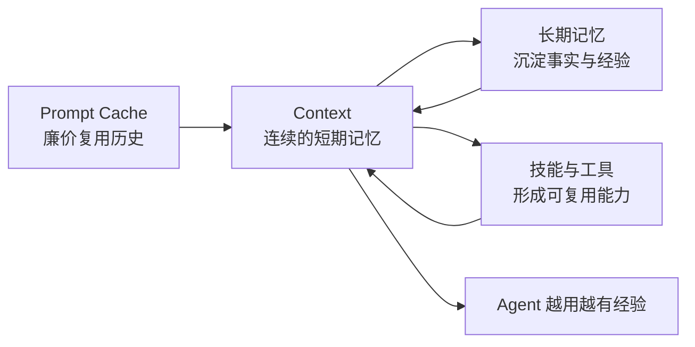

# 模型决定智商，上下文决定工龄

## 永续上下文：让 Agent 用得起、接得上、长得大

> 没有永续上下文，再强的 Agent 也是每天第一天上班。

今天的大模型已经足够聪明，也开始拥有数十万乃至百万 token 的上下文窗口。但很多 AI 产品仍然把每次对话设计成一个孤立 Session：任务结束后丢掉工作现场，下一次再依赖摘要、RAG 或用户重新说明背景。

这相当于一边训练越来越聪明的模型，一边在产品层面让它反复失忆。

永续上下文主张一种不同的默认选择：**只要信息仍属于当前任务，就优先保留原始上下文；真正遇到容量、成本或相关性压力时，再谨慎压缩和遗忘。**

它不是让模型永远背着全部历史，也不是用一个无限增长的 Prompt 代替所有记忆系统。它是一块 Agent 成长底座：

1. 用 Prompt Cache 廉价复用稳定历史；
2. 用 Context 维持连续、高保真的短期工作记忆；
3. 根据具体场景扩展长期记忆、技能、工具和其他能力。

最终产生的结果是：**同一个模型不需要重新训练，也可以随着经历增加，成为更有经验的 Agent。**



## 一、用得起：Cache 改变了长期上下文的经济模型

过去不保留完整上下文是一个合理选择，因为每轮重新处理几十万 token 的成本和延迟都难以接受。

在没有缓存时，一段持续增长的对话近似于：

```text
第 1 轮：处理 A
第 2 轮：重新处理 A + B
第 3 轮：重新处理 A + B + C
第 4 轮：重新处理 A + B + C + D
```

Prompt Cache 改变了这笔账：

```text
稳定历史前缀  × 缓存价
本轮新增内容  × 正常输入价
模型输出      × 输出价
+ 缓存写入、存储或超长上下文溢价
```

截至 2026 年 7 月，OpenAI 多个前沿模型的 cached input 标价约为普通输入的十分之一；Anthropic 公布的标准 cache read multiplier 同样为普通输入的 0.1 倍。Google 也把 context caching 明确列为长上下文的主要成本优化手段。具体价格会变化，但行业方向已经很清楚：**稳定前缀正在成为一种可以反复复用的计算资产。**

这特别适合长期 Agent。它的 System Prompt、工具定义和大部分历史通常保持稳定，每轮主要在尾部增加新消息和工具结果。Agent 使用得越连续，固定历史被复用的次数越多，首次建立上下文的成本就越容易被摊薄。

但 Cache 不是免费，也不是持久记忆。它的收益依赖：

- 前缀足够稳定；
- 在缓存有效期内重复使用；
- 不频繁切换模型或工具定义；
- 后续请求主要追加尾部，而不是重排历史；
- 节省的读取成本能够覆盖 cache write、存储和长上下文溢价。

Cache 过期后，Agent 的历史不应消失，只是下一次需要重新计算。可以把二者的关系概括成：

> Context 负责连续，Cache 负责便宜。

## 二、接得上：Context 是 Agent 的短期工作记忆

长期 Memory 保存的是事实和结论，Context 保存的是工作现场。

Context 中包含：

- 当前正在解决什么问题；
- 事情为什么会发展到这里；
- 哪些方案已经失败；
- 哪些判断只是临时假设；
- 用户刚刚纠正了什么；
- 工具调用产生了什么结果；
- 哪些目标和承诺尚未完成；
- 当前一句“还是用刚才那个”究竟指什么。

长期记忆可能保存：

> 团队最终选择了方案 B。

而完整上下文还知道：

> 方案 B 是在交付时间紧张时作出的临时选择；当时排除方案 A 的原因是性能假设尚未验证；现在新的测试结果已经改变了这个前提。

这就是 RAG 和长期 Memory 无法完全替代原始上下文的地方。检索可以找回一条信息，却不一定能恢复它在整段经历中的时间、因果、语气和有效性。

> Memory 记住的是知识，Context 保留的是现场。

对于正在进行的工作，最准确的召回往往不是“搜索得更准”，而是相关信息从未离开工作记忆。

## 三、长得大：在永续上下文上按需扩展能力

永续上下文不是一个封闭的 Memory 功能。自己构建 Agent 时，可以根据实际需求选择需要生长的能力，而不必把所有场景塞进一套通用记忆设计。

### 长期语义记忆

保存跨越当前任务仍然稳定的内容，例如：

- 用户和团队偏好；
- 项目中的稳定事实；
- 游戏机制和通用策略；
- 历史教训；
- 人物、组织与环境认识。

### 情节记忆

保存关键经历及其后果，例如：

- 某一局游戏为什么失败；
- 某次项目为什么延期；
- 哪次实验推翻了旧判断；
- 某个决定后来造成了什么影响。

### 技能与程序性记忆

把反复验证有效的方法变成可以复用的能力，例如：

- 某类卡组的构筑和操作套路；
- 特定 Boss 的应对策略；
- 排查某种故障的标准流程；
- 生成某类报告的工作步骤。

### 自我认识

让 Agent 逐渐知道：

- 自己在哪类判断上容易犯错；
- 哪些结论必须额外验证；
- 什么情况下应该主动求助；
- 哪些策略过去看似合理，但实际效果很差。

### 领域工具

不同 Agent 可以生长出完全不同的工具集合：

- 游戏 Agent：读取状态、执行操作、分析回放；
- 项目 Agent：读取文档、任务、代码和会议记录；
- 研究 Agent：搜索论文、维护假设和证据；
- 运营 Agent：观察指标、生成报告、跟踪异常。

因此，永续上下文真正提供的不是一个固定功能，而是一个能够继续生长的基础。

## 四、从“保存历史”到“Agent 进化”

Cache、Context、Memory 和 Tools 单独存在时，都只是局部能力。组合起来后，才会形成经验的复利：

```text
经历一次任务
→ Context 保留高保真的工作现场
→ 从结果和反馈中复盘
→ 重要经验进入长期记忆或技能
→ 下一次任务重新使用
→ Agent 的行为和表现发生变化
```

这里的“进化”不等于 Agent 修改了基础模型权重。它至少可以包括四个层次：

1. **情节记忆**：记得自己经历过什么；
2. **策略认识**：从多次成败中抽象规律；
3. **程序性能力**：形成可以复用的技能和流程；
4. **元认知**：知道自己的长处、弱点和常见错误。

最值得观察的现象是：

> 模型参数没有变化，但 Agent 因为经历增加而变强了。

可以把它概括成：

> 模型训练产生天赋，永续上下文产生经验。

## 五、娱乐案例：从游戏新手成长为老玩家

游戏是展示永续上下文最直观的场景：行为和反馈清楚、失败成本低、可以重复实验，成长也容易量化。

### 《杀戮尖塔》：更适合证明成长

《杀戮尖塔》具有几个适合长期 Agent 的特点：

- 回合制，Agent 有时间分析；
- 每局从相似起点重新开始；
- 决策链长且大量选择不可逆；
- 存在随机性，但规则保持稳定；
- 局部收益与长期收益经常冲突；
- 胜率、到达层数和进阶等级容易衡量。

最有说服力的实验不是“让最强模型通关一次”，而是让两个相同模型连续运行：

| Agent | 每局结束后的处理 |
|---|---|
| 失忆 Agent | 清空经历，下一局重新开始 |
| 永续 Agent | 保留经历，并沉淀失败原因、策略和自我评价 |

在相同模型、相同预算和相同游戏接口下连续运行 50 局或 100 局，然后比较：

- 胜率和平均到达层数；
- 是否减少重复错误；
- 是否形成角色和流派知识；
- 是否能解释自己的策略变化；
- 是否能把旧经验迁移到新卡组和新局面。

这个实验真正回答的是：

> 同一个模型，有经历和没有经历，会不会逐渐变成两个不同水平的玩家？

### 《宝可梦》：更适合传播故事

《宝可梦》的大众认知度更高，而且“Agent 进化”和“宝可梦进化”形成天然双关。

PokéLLMon 已经展示了 LLM Agent 可以通过对战反馈、外部知识和行为一致性机制，在宝可梦对战中形成接近人类玩家的策略。完整 RPG 通关的故事性更强，但导航、视觉识别和长时间操作故障可能掩盖永续上下文本身的价值。

因此，如果强调实验，优先考虑《杀戮尖塔》；如果强调传播，可以使用《宝可梦》包装“Agent 进化”的故事。

## 六、工作案例：从 AI 工具到有工龄的同事

“超级员工”足够吸引眼球，但容易引发替代焦虑，也容易让讨论跑到权限和失控问题上。更准确的概念是：

> 一个不需要每天重新入职、能够逐渐获得工龄的 AI 同事。

一个真正有工龄的 AI 同事，不只是能够搜索公司文档，而是经历过：

- 为什么项目采用当前方案；
- 哪些尝试已经失败；
- 谁曾经担心什么问题；
- 哪些指标改变过团队判断；
- 哪次事故促成了新的规范；
- 某个承诺为什么还没有完成；
- 相同问题过去是怎样解决的。

### 项目老员工

比“万能超级员工”更可信的方案，是让一个 Agent 从项目第一天开始持续参与：

- 读取需求和讨论；
- 理解决策及其前提；
- 观察开发、测试和上线结果；
- 跟踪尚未闭环的问题；
- 参与事故复盘；
- 在后续版本中复用经验。

一个月以后，新成员可以问它：

- 为什么当初没有采用另一个方案？
- 这个限制是业务要求还是历史遗留？
- 我们是否遇到过类似事故？
- 哪些假设已经被证明错误？
- 谁最了解这个模块？
- 当前还有哪些没有兑现的承诺？

它的价值不在于“知道所有事情”，而在于保留了团队工作的连续性。

### 常驻 Agent 与临时专家

不一定需要为每个岗位都建立一个永久 AI 员工。一个更清晰的组织方式是：

```text
一个有工龄的常驻 Agent
        ↓
理解项目历史、目标和当前状态
        ↓
按需调用临时专家 Agent 完成具体任务
        ↓
结果重新回到常驻 Agent 的经历中
```

> 常驻 Agent 负责拥有经历，临时 Agent 负责提供能力。

这样既保留一条连续的项目时间线，也允许按需使用不同模型和专业能力。

## 七、为什么现在是一个趋势拐点

永续上下文正在变得可行，不是因为某一个因素，而是三个变量同时变化：

1. **物理窗口扩大**：OpenAI、Gemini 和 Claude 的前沿模型已经进入百万 token 级别；
2. **有效上下文改善**：新模型在几十万乃至百万 token 区间的多信息召回能力持续提升；
3. **Cache 降低成本**：稳定历史可以用显著低于普通输入的价格反复复用。

物理窗口解决“能不能装下”，有效上下文解决“能不能用好”，Prompt Cache 解决“能不能长期用得起”。

未来可能形成三层 Agent 记忆：

| 层级 | 内容 | 特点 |
|---|---|---|
| 热层：原始 Context | 当前任务的完整现场 | 高保真、直接可用、适合 Cache |
| 温层：阶段上下文 | 已结束阶段的经历和未完成事项 | 更紧凑，保留因果与连续性 |
| 冷层：长期记忆 | 稳定事实、旧项目和大量历史 | 按需检索，不常驻当前工作集 |

大窗口不会消灭 RAG，而是会改变 RAG 的位置：

> RAG 不再负责抢救刚刚被丢掉的工作现场，而是负责访问真正离开当前任务的冷知识。

## 八、必须正视的限制

### 大窗口不等于完整理解

模型能在 60 万 token 后找到开头的一句话，不代表它能稳定综合全部 60 万 token。已有长上下文研究反复观察到：

- 中间位置的信息利用更弱；
- 多条信息的聚合比单一 needle retrieval 更困难；
- 输入变长后，即使相关证据可被找到，推理表现仍可能下降。

所以应该区分“标称窗口”和“有效窗口”。

### 上下文越长，噪声也越多

永续上下文会同时积累：

- 正确经验；
- 错误判断；
- 过期计划；
- 重复工具结果；
- 无关闲聊；
- 外部内容中的恶意指令。

未来真正稀缺的可能不再是容量，而是注意力：哪些内容此刻仍然重要，哪些已经过期，哪些应该重新带到上下文尾部。

### 进化可能走向错误方向

Agent 可能从偶然成功中总结错误规律，也可能不断强化早期偏见，形成策略僵化。因此，自我复盘不能只记录结论，还需要保留证据、结果和不确定性，并允许后续经历纠正旧认识。

### 长期运行扩大隐私和权限问题

持续保存工作和关系历史意味着更大的隐私责任。用户和组织需要知道：

- Agent 保存了什么；
- 哪些内容被用于 Cache；
- 谁可以读取和纠正；
- 如何删除或隔离；
- 不同用户、项目和场景能否互相污染。

因此，“永续”不应等于“永不删除”，而应该意味着连续性不会被无缘无故打断。

## 九、分享时要宣扬的核心主张

这场分享不是要宣扬“把所有历史永久塞进 Prompt”，而是要宣扬一种新的默认顺序：

```text
过去：默认遗忘，需要时召回
未来：默认保留，确有压力时再压缩
```

可以把核心价值浓缩成三句话：

1. **用得起**：Prompt Cache 让稳定历史变成可以廉价复用的计算资产；
2. **接得上**：Context 为 Agent 提供连续、高保真的短期工作记忆；
3. **长得大**：长期记忆、技能和工具可以根据具体需求逐步扩展。

最终落到一句传播口号：

> 模型决定智商，上下文决定工龄。

或者：

> 模型训练给了 Agent 智力，工具给了 Agent 行动力，永续上下文给了 Agent 经验和工龄。

## 十、建议的分享结构

### 标题

**《模型决定智商，上下文决定工龄：从游戏老玩家到 AI 老员工》**

### 30 分钟版本

1. **3 分钟：每天重新入职的 AI**

   为什么模型越来越聪明，产品中的 Agent 仍然经常失忆。
2. **6 分钟：永续上下文的三层价值**

   用得起、接得上、长得大。
3. **7 分钟：游戏 Agent 的成长实验**

   两个相同模型，一个每局失忆，一个保留经历。
4. **6 分钟：从游戏老玩家到项目老员工**

   为什么工作 Agent 需要工龄，而不只是知识库。
5. **5 分钟：大窗口和 Cache 带来的趋势拐点**

   从默认遗忘转向默认保留。
6. **3 分钟：限制与结论**

   大窗口不等于完整理解，永续也不等于永不删除。

### 开场

> 假设有两个完全相同的 Agent，让它们连续玩 100 局《杀戮尖塔》。一个每局结束后清空记忆，另一个保留自己的失败、策略和复盘。100 局以后，它们还是同一个 Agent 吗？

### 收尾

> 模型训练给了 Agent 天赋。<br>
> Context 给了 Agent 短期记忆。<br>
> Memory 和 Tools 给了 Agent 成长空间。<br>
> Prompt Cache 让这一切能够以可接受的成本长期运行。
>
> 没有永续上下文，再强的 Agent 也是每天第一天上班。

## 参考资料

- [OpenAI Models：上下文窗口和 cached input 定价](https://developers.openai.com/api/docs/models)
- [OpenAI GPT-5.6：长上下文评测](https://openai.com/index/gpt-5-6/)
- [OpenAI GPT-5.4：长上下文评测与定价说明](https://openai.com/index/introducing-gpt-5-4/)
- [Anthropic Pricing：Prompt Cache 与长上下文计价](https://docs.anthropic.com/en/docs/about-claude/pricing)
- [Google Gemini：Long Context](https://ai.google.dev/gemini-api/docs/long-context)
- [Google Gemini：Context Caching](https://ai.google.dev/gemini-api/docs/caching)
- [Lost in the Middle](https://arxiv.org/abs/2307.03172)
- [RULER: What’s the Real Context Size of Your Long-Context Language Models?](https://arxiv.org/abs/2404.06654)
- [Context Length Alone Hurts LLM Performance Despite Perfect Retrieval](https://arxiv.org/abs/2510.05381)
- [Voyager: An Open-Ended Embodied Agent with Large Language Models](https://arxiv.org/abs/2305.16291)
- [PokéLLMon: A Human-Parity Agent for Pokémon Battles with Large Language Models](https://arxiv.org/abs/2402.01118)
- [SIMA 2: An Agent That Plays, Reasons, and Learns](https://deepmind.google/blog/sima-2-an-agent-that-plays-reasons-and-learns-with-you-in-virtual-3d-worlds/)
- [TheAgentCompany: Benchmarking LLM Agents on Consequential Real World Tasks](https://papers.neurips.cc/paper_files/paper/2025/hash/0d744742f6fac4d1134c019b7cef3c8a-Abstract-Datasets_and_Benchmarks_Track.html)
- [OpenAI Frontier：AI Coworkers 与企业上下文](https://openai.com/index/introducing-openai-frontier/)
