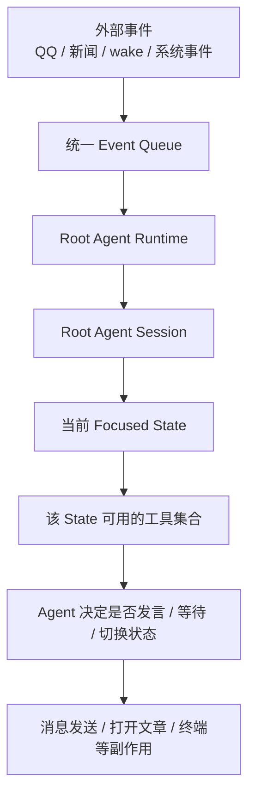
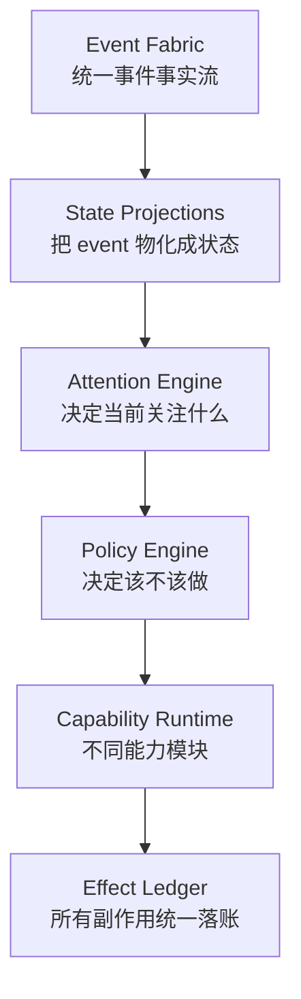
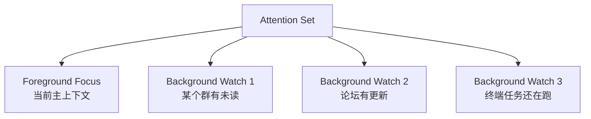
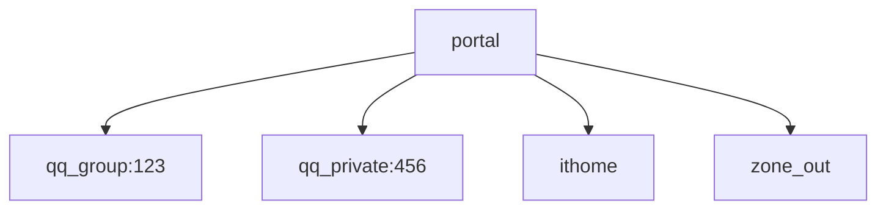
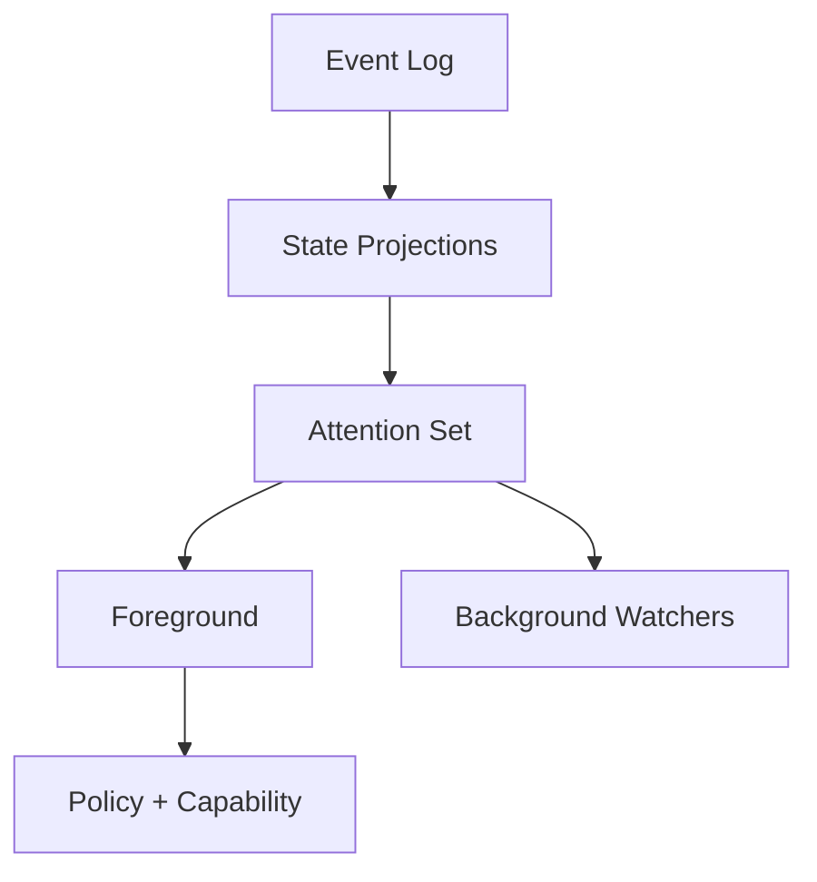
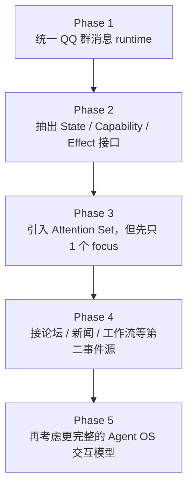

# Agent OS 设计草案：Kagami 借鉴点、分歧点与收益分析

## 1. 这份文档回答什么问题

这份文档不是在回答：

- `qq-bot-v2` 现在该不该立刻改完全部架构

它回答的是：

1. 如果目标最终是 `Agent OS`，应该怎样理解 Kagami 当前的设计。
2. Kagami 哪些点值得借鉴，哪些点不应该直接照搬。
3. 如果从更通用的 Agent 角度设计，我建议的内核长什么样。
4. 这些差异分别带来什么收益和复杂度变化。

一句话结论先写在前面：

- 我认同 Kagami 的大方向：统一事件流、单一 root runtime、持久化 session。
- 但我不建议把 Kagami 当前的 `portal / enter / back / state tree` 当成唯一正确答案。
- 我更推荐把底层设计成一个更通用的 `Agent OS Kernel`：
  `Event -> Projection -> Attention -> Policy -> Capability -> Effect`

---

## 2. Kagami 现在到底在做什么

从代码看，Kagami 的核心不是“QQ 机器人”，而是“一个在多个生活域之间切换的 Agent”。

几个关键代码锚点：

- 统一事件队列：
  `packages/agent-runtime/src/event-queue.ts`
- root runtime 消费事件：
  `apps/server/src/agent/runtime/root-agent/root-agent-runtime.ts`
- session / state 切换：
  `apps/server/src/agent/runtime/root-agent/session/root-agent-session.ts`
- 不同 state 下不同工具权限：
  `ROOT_AGENT_INVOKE_TOOLS_BY_STATE`
- 消息发送工具：
  `apps/server/src/agent/capabilities/messaging/tools/send-message.tool.ts`

Kagami 的当前心智模型可以概括成：

Kagami 的几个关键特征：

- 一切输入都先变成 event。
- Agent 当前“在哪个 state”很重要。
- 是否能发送消息，不是看事件类型，而是看当前 state 是否开放 `send_message`。
- 主动和被动不是两条发送管线，而是同一 runtime 下的不同行为结果。

---

## 3. Kagami 的优点

### 3.1 真正统一了输入模型

QQ 群消息、新闻更新、wake 定时器，本质都是 event。

好处：

- 恢复路径统一
- 不会出现“消息走 A runtime、新闻走 B runtime”的双中心
- 以后加论坛、工作流、游戏事件时，入口不会推翻

### 3.2 真正有 session 概念

Kagami 持久化的不是“几条对话”，而是：

- 当前 focus 在哪
- 状态栈是什么
- 各状态有哪些未读
- 哪些状态之前进入过

好处：

- 重启后不仅能记得历史，还能记得“自己现在在哪”
- 多状态体验更自然

### 3.3 工具权限按 state 切换

这点非常重要。

例如：

- `portal` 下不能直接发群消息
- `qq_group:*` 下才能 `send_message`
- `ithome` 下只能开文章

好处：

- 减少错误副作用
- 让 Agent 的动作更有上下文边界

---

## 4. Kagami 的局限

### 4.1 它把“产品交互隐喻”放得太靠近内核

Kagami 当前大量围绕这些概念展开：

- `portal`
- `qq_group:*`
- `qq_private:*`
- `ithome`
- `zone_out`
- `terminal`
- `enter`
- `back`

这些作为产品是成立的，但作为底层内核，不一定是最通用的抽象。

问题在于：

- 以后如果不是“页面式切换”，而是多任务并行关注，这套模型会有点紧。
- 它更像“导航树”，不完全像“注意力调度系统”。

### 4.2 主动行为更像涌现，不像显式策略

Kagami 现在没有很强的“主动发言频控器”。

它更像靠下面这些间接约束：

- `notificationBatchWindowMs`
- `waitToolMaxWaitMs`
- unread 聚合
- state focus 切换
- 模型自主决定要不要 `enter` 某个 state 再说话

这适合实验系统，但如果做产品，会比较难控。

### 4.3 `state tree` 不是唯一正确形式

对于真正的 Agent OS，问题不一定是：

- “我现在在第几层页面”

更常见的问题其实是：

- “我现在最关注什么”
- “哪些东西在后台挂着”
- “什么变化值得打断我”

这其实更接近 `attention scheduler`，而不只是 `state tree navigator`。

---

## 5. 我的设计：Agent OS Kernel

我会把系统抽象成 6 层。

### 5.1 Event Fabric

统一事件流。

包括：

- 群消息
- 私聊
- 新闻
- 论坛更新
- 定时器
- 系统 wake
- 工具执行结果

这里我和 Kagami 一致。

### 5.2 State Projections

状态不是事实，event 才是事实。

状态只是投影。

例如可以有：

- `chat_state`
- `feed_state`
- `task_state`
- `workspace_state`
- `notification_state`
- `attention_state`

好处：

- 恢复更稳
- 调试更稳
- 迁移更稳
- 不会把某种 UI 心智模型硬编码成事实层

### 5.3 Attention Engine

这是我和 Kagami 最大的分歧点。

我更想把 Agent 理解成：

- 有一个 `foreground focus`
- 有若干 `background watches`
- 有一套 attention 切换规则

而不是单纯：

- 先在 `portal`
- 再 `enter`
- 然后 `back`

可以把它想成：

这个模型更适合未来的 Agent OS，因为未来更像：

- 一边盯群
- 一边刷论坛
- 一边等任务
- 一边看新闻

这不是单页面导航问题，而是注意力分配问题。

### 5.4 Policy Engine

Kagami 比较偏“模型自己决定要不要做”，我会更强调显式策略层。

策略层负责：

- 是否触发一轮
- 是否允许主动打断
- 是否允许发言
- 是否进入某状态
- 频率是否过高
- 预算是否足够
- dry run / canary / allowlist

这层的好处是：

- 你能控行为
- 能解释为什么做或不做
- 能产品化上线

### 5.5 Capability Runtime

能力不是“工具函数堆”，而是带状态和副作用边界的模块。

例如：

- messaging capability
- forum capability
- news capability
- terminal capability
- task capability
- memory capability

每个 capability 定义：

- 接收什么 event
- 暴露什么 action
- 维护什么 projection
- 触发什么副作用

### 5.6 Effect Ledger

所有副作用必须统一落账。

包括：

- 发群消息
- 发私聊
- 发帖
- 点赞
- 执行命令
- 调外部 API
- 写文件

而且必须有：

- idempotency key
- dry run 标记
- retry 状态
- audit trail

这是我认为比 Kagami 还要更需要强调的部分。

---

## 6. 我设计的核心差异

### 6.1 差异一：Kagami 是 `state tree first`，我更偏 `attention first`

Kagami：

我的设计：

收益：

- 更适合多任务并行关注
- 不把产品导航结构写死到内核
- 更像操作系统，而不是页面路由

### 6.2 差异二：Kagami 更依赖模型决策，我更强调策略显式化

Kagami 的做法更像：

- 有未读
- 模型自己决定要不要 `enter`
- 进入后自己决定要不要 `send_message`

我会改成：

- 先由 policy 判断是否值得打断 / 是否值得发言
- 再允许模型进入 deliberation

收益：

- 更容易控成本
- 更容易控频率
- 更容易做上线策略
- 更容易做 dry run / canary

### 6.3 差异三：Kagami 的发送是统一的，但 effect ledger 不够前置

Kagami 已经做对了“统一发送工具面”。

我会再前进一步：

- 所有副作用都先经过 effect ledger
- 把发送、执行、写入都纳入相同治理面

收益：

- 幂等更稳
- 审计更稳
- 重试更稳
- 多能力系统时不会各自长一套副作用状态机

---

## 7. 如果只考虑 MVP，要不要按 Kagami 那样做

我的答案是：

- 不要按 Kagami 的完整产品形态做
- 但应该按“可承载 Agent OS 的内核骨架”做

也就是：

### 7.1 现在就该做的

- 统一事件流
- 单一 root runtime
- 单一 persisted session
- 能挂多个 capability 的接口
- effect ledger
- 最小状态抽象

### 7.2 现在不要做满的

- 完整 `portal`
- 完整 `enter/back`
- 完整多域状态树
- 复杂 attention planner
- 太强的生活体人格 UI

### 7.3 一个比较合适的 MVP 形态

当前只保留：

- `messaging capability`
- 一个最小 `focusedStateId`
- 一个最小 `stateStack`
- 一个最小 `attention set` 接口
- 一个统一 `effect ledger`

这时候即使你只接 QQ 群，也已经不是“聊天机器人架构”了，而是“可扩展到 Agent OS 的最小内核”。

---

## 8. 对 `qq-bot-v2` 的建议

如果把 `qq-bot-v2` 当成未来 Agent OS 的前身，我建议分三层看。

### 8.1 当前能直接借的

- 单一 root runtime
- 统一 event 入口
- snapshot-first restore
- 发送能力统一入口

### 8.2 当前要改造后再借的

- session persistence
- state abstraction
- 消息/新闻/论坛等 capability 化
- notification batching

### 8.3 当前不要照搬的

- `portal` 作为唯一中心
- `enter/back` 作为主要交互心智
- 让模型自己完全决定主动发言频率

---

## 9. 一个更合适的演进顺序

这样做的好处是：

- 不会一上来过度抽象
- 但也不会把未来扩展路径堵死

---

## 10. 最终结论

Kagami 的方向不是错的，但它更像：

- 一个已经产品化了部分交互心智的实验 Agent

如果目标是更通用的 Agent OS，我建议的设计比 Kagami 更偏内核：

- Kagami 更像：`生活体 Agent Runtime`
- 我建议的是：`Agent OS Kernel`

两者的最大区别不是“谁更高级”，而是抽象边界不同：

- Kagami 把“生活方式”写进了很多 runtime 概念
- 我会把“生活方式”留给 capability 和产品层，把内核做成更中性的操作系统

一句话总结：

> 借 Kagami 的事件统一与常驻 runtime，舍弃它对具体生活形态的强预设，把内核抬升为 `Event + Projection + Attention + Policy + Capability + Effect` 的 Agent OS。

---

## 11. 简表对比

| 维度 | Kagami 当前设计 | 我建议的设计 | 收益 |
|---|---|---|---|
| 输入模型 | 统一 event | 统一 event | 一致 |
| 状态模型 | state tree / state stack | projection + attention | 更通用 |
| 状态切换 | `enter/back` 很核心 | 可选 UI/工具，不做内核中心 | 更灵活 |
| 行为控制 | 偏模型自主 | policy 显式化 | 更可控 |
| 发送模型 | 统一 `send_message` | 统一 action/effect | 一致，但更强调副作用治理 |
| 主动频控 | 更多靠节奏涌现 | 显式 budget / cooldown / gate | 更产品化 |
| 可扩展性 | 强，但带产品心智预设 | 更适合做 Agent OS 内核 | 更长期 |
